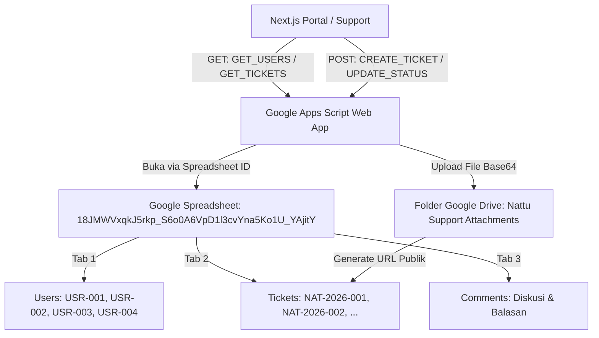

# Rencana Implementasi & Panduan Integrasi Database Google
## Portal Support & Ticketing System — PT Nattu Global Synergy

Dokumen ini merinci arsitektur sistem ticketing, panduan konfigurasi Google Spreadsheet & Google Drive sebagai database backend, serta solusi untuk mengatasi kendala integrasi.

---

## 1. Arsitektur Database (Google Sheets & Google Drive)



---

## 2. Penyebab "Internal Server Error" & Solusinya

Ada 3 penyebab utama terjadinya *Internal Server Error* pada Google Apps Script:

### ⚠️ Penyebab 1: Script Standalone Gagal Menemukan Spreadsheet (Search Timeout)
- **Masalah:** Jika `SPREADSHEET_ID` dikosongkan pada script standalone, fungsi `DriveApp.getFilesByName()` akan mencari seluruh drive akun Google Anda yang membutuhkan waktu lama (timeout > 15 detik) atau gagal.
- **Solusi:** Tentukan ID Spreadsheet secara eksplisit pada baris 28 di `Code.js`:
  ```javascript
  const SPREADSHEET_ID = "18JMWVxqkJ5rkp_S6o0A6VpD1l3cvYna5Ko1U_YAjitY";
  ```

### ⚠️ Penyebab 2: Kode Apps Script Diupdate tetapi Deployment Belum "New Version"
- **Masalah:** Google Apps Script tidak otomatis menerapkan perubahan kode ke URL Web App aktif sampai Anda membuat versi rilis baru (*New Version*). Jika endpoint menerima action baru seperti `VERIFY_USER` yang belum ada di versi lama, server mengembalikan error 500.
- **Solusi:**
  1. Buka [script.google.com](https://script.google.com).
  2. Klik **Deploy** ➔ **Manage deployments**.
  3. Klik ikon **Pensil (Edit)** pada deployment aktif Anda.
  4. Pada dropdown **Version**, pilih **New version**.
  5. Klik **Deploy**.

### ⚠️ Penyebab 3: Akses Hak Izin (*Permission / Who has access*)
- **Masalah:** Jika opsi *"Who has access"* disetel ke *"Only myself"*, browser atau pengunjung umum akan ditolak dengan error internal.
- **Solusi:**
  - **Execute as:** `Me (akun Google Anda)`
  - **Who has access:** `Anyone` (Siapa saja)

---

## 3. Langkah Konfigurasi Ulang Google Apps Script (Step-by-Step)

1. **Buka Project Google Apps Script:**
   - Kunjungi [script.google.com](https://script.google.com) dan buka project Anda.
2. **Salin Kode Terbaru:**
   - Salin seluruh isi berkas [`google-apps-script/Code.js`](file:///Users/dendyaditya/Projects/windy_project/google-apps-script/Code.js) yang sudah disesuaikan dengan ID Spreadsheet Anda:
     ```javascript
     const SPREADSHEET_ID = "18JMWVxqkJ5rkp_S6o0A6VpD1l3cvYna5Ko1U_YAjitY";
     ```
3. **Jalankan Inisialisasi (Opsional / Sekali Saja):**
   - Pada dropdown fungsi di atas editor, pilih `initialSetup`, lalu klik **Run** untuk memastikan header tabel `Users`, `Tickets`, `Comments`, dan folder Drive telah siap.
4. **Deploy Versi Baru (*Critical*):**
   - Klik tombol **Deploy** di pojok kanan atas ➔ **Manage deployments**.
   - Klik ikon **Edit (Pensil)** ➔ Ubah **Version** menjadi **New version**.
   - Pastikan **Execute as:** `Me` dan **Who has access:** `Anyone`.
   - Klik **Deploy**.
5. **Konfigurasi URL di Portal:**
   - Salin URL Web App hasil deploy (berakhiran `/exec`) dan pastikan tersimpan di berkas [`.env.local`](file:///Users/dendyaditya/Projects/windy_project/.env.local):
     ```env
     NEXT_PUBLIC_GOOGLE_APPS_SCRIPT_URL=https://script.google.com/macros/s/AKfycbxi8i0ir-RalqIeSi8VZ3EGLa5DMf9X6Kb_D8Sr5S3lXIzfrg9DTd1CBqFySVHQfO_B/exec
     ```

---

## 4. Struktur Tab di Google Spreadsheet

| Tab Name | Kolom Utama | Fungsi |
| :--- | :--- | :--- |
| **`Users`** | `User_ID`, `Full_Name`, `Email`, `Role`, `Password_PIN`, `Department` | Menyimpan akun user staf & admin untuk otentikasi login. |
| **`Tickets`** | `Ticket_ID`, `Ticket_Number`, `Created_At`, `Client_Name`, `Client_Email`, `Subject`, `Description`, `Status`, `SLA_Level`, `AI_Level0_Reply`, `Admin_Notes` | Menyimpan semua tiket support dan riwayat penanganan. |
| **`Comments`** | `Comment_ID`, `Ticket_ID`, `Sender_Name`, `Sender_Role`, `Message`, `Timestamp` | Menyimpan riwayat obrolan diskusi antara klien, auto-reply, dan admin. |

---

## 5. Ringkasan Fitur Sistem yang Terintegrasi
1. **User Biasa:** Login di `/support/login` ➔ Buat & lihat tiket sendiri.
2. **Auto-Reply Gmail:** Instan troubleshooting Gmail ➔ Konfirmasi pemahaman di bawah diskusi.
3. **Admin Real Agent:** Login terpisah di `/support/admin` ➔ Balas manual tiket klien.
4. **Auto-Close 3 Jam Idle:** Tiket otomatis ditutup dan dikunci jika 3 jam tanpa tanggapan user.
5. **Fitur Tutup Tiket Mandiri:** Tombol tutup tiket cepat di header dan di bawah diskusi.
