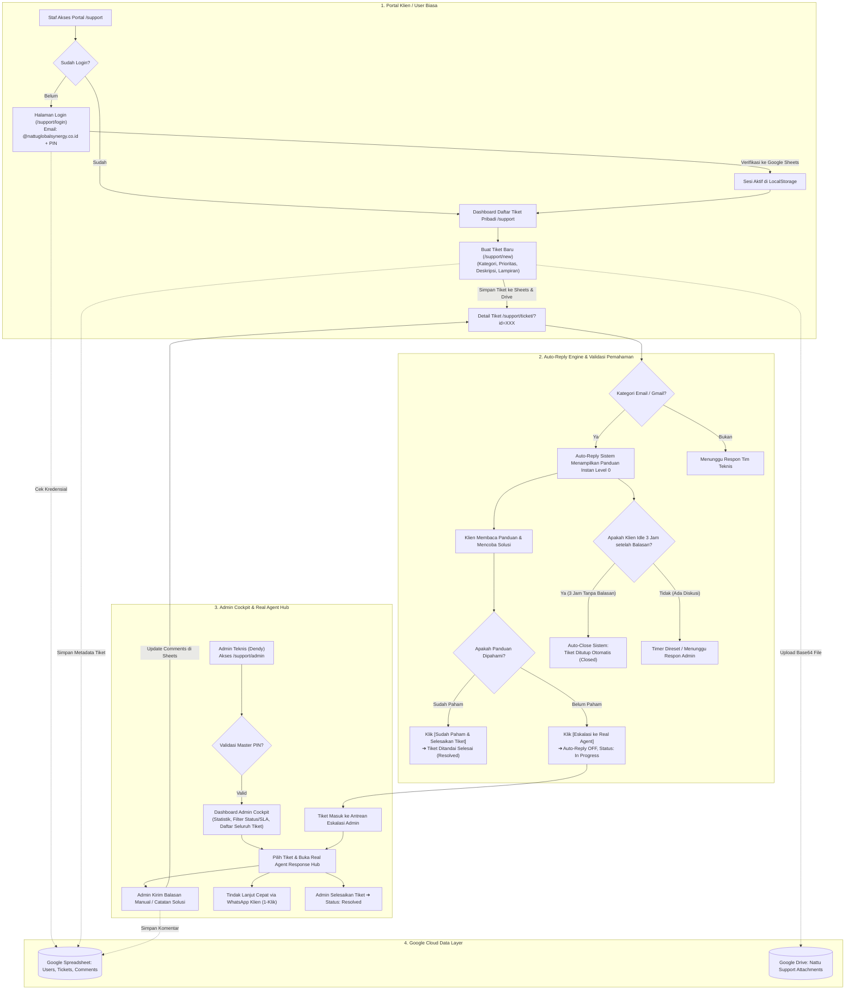
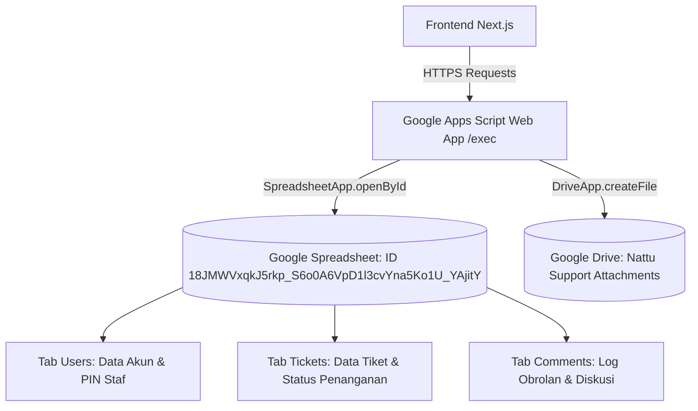

# Rencana Implementasi & Panduan Lengkap Arsitektur Sistem
## Portal Support & Ticketing System — PT Nattu Global Synergy

Dokumen ini merinci **alur kerja menyeluruh (end-to-end flow)** seluruh sistem ticketing, modul dan fitur aplikasi, arsitektur integrasi database Google (Spreadsheet & Drive), serta panduan operasional teknis.

---

## 📌 Daftar Isi
1. [Diagram Alur Kerja Menyeluruh (End-to-End System Flow)](#1-diagram-alur-kerja-menyeluruh-end-to-end-system-flow)
2. [Rincian Modul & Fitur Aplikasi](#2-rincian-modul--fitur-aplikasi)
   - [Modul 1: Portal Klien / Staf Pengguna](#modul-1-portal-klien--staf-pengguna)
   - [Modul 2: Engine Auto-Reply & Aturan Auto-Close 3 Jam](#modul-2-engine-auto-reply--aturan-auto-close-3-jam)
   - [Modul 3: Admin Cockpit & Real Agent Response Hub](#modul-3-admin-cockpit--real-agent-response-hub)
   - [Modul 4: Backend Database & Storage Layer (Google Integration)](#modul-4-backend-database--storage-layer-google-integration)
3. [Arsitektur Database (Google Sheets & Google Drive)](#3-arsitektur-database-google-sheets--google-drive)
4. [Struktur Data & Skema Tabel Google Spreadsheet](#4-struktur-data--skema-tabel-google-spreadsheet)
5. [Panduan Konfigurasi & Troubleshooting Google Apps Script](#5-panduan-konfigurasi--troubleshooting-google-apps-script)

---

## 1. Diagram Alur Kerja Menyeluruh (End-to-End System Flow)

---

## 2. Rincian Modul & Fitur Aplikasi

### Modul 1: Portal Klien / Staf Pengguna
* **Halaman Login Staf (`/support/login`):**
  * Verifikasi email `@nattuglobalsynergy.co.id` dan PIN 4-6 digit yang terdaftar di Google Spreadsheet.
  * Dilengkapi **Deteksi Sesi Aktif (*Active Session Card*)**: Jika staf sudah login, halaman menampilkan profil aktif dengan tombol *"Buka Daftar Tiket"* dan opsi *"Ganti Akun"*.
* **Dashboard Daftar Tiket (`/support`):**
  * **Isolasi Data Staf**: Menampilkan tiket yang dibuat oleh akun email yang sedang aktif.
  * Ringkasan status tiket (*Open*, *In Progress*, *Resolved*, *Closed*).
* **Pembuatan Tiket Baru (`/support/new`):**
  * Auto-fill identitas staf (Nama, Email, Departemen).
  * Pemilihan kategori (*Troubleshooting Email/Gmail*, *Bug Website*, *Permintaan Fitur*).
  * Upload lampiran file/screenshot (Maks. 10 MB) yang dikonversi ke Base64 dan disimpan di Google Drive.
* **Halaman Detail & Ruang Diskusi (`/support/ticket/?id=...`):**
  * Tracker status 4 tahap (*Tiket Diterima ➔ Auto-Reply Sistem ➔ Respon Real Agent ➔ Selesai*).
  * Ruang obrolan real-time untuk diskusi dan pertanyaan lanjutan.
  * **Fitur Tutup Tiket Mandiri**: Tombol `[ ✕ Tutup Tiket Ini ]` di header atas dan tombol konfirmasi di bawah diskusi.

---

### Modul 2: Engine Auto-Reply & Aturan Auto-Close 3 Jam
* **Auto-Reply Level 0 (Integrasi Gmail):**
  * Menganalisis kata kunci (*delay*, *tarik email*, *password*, *authentication*, *smtp*, *port 465*).
  * Menampilkan panduan terstruktur langkah penarikan email instan (*Check mail now*), update password, dan pengaturan server.
* **Mekanisme Auto-Reply OFF Saat Eskalasi:**
  * Begitu staf menekan tombol *"Eskalasi ke Real Agent"* atau tiket berstatus `in_progress`, bot auto-reply **otomatis dimatikan** agar percakapan sepenuhnya ditangani secara personal oleh admin manusia.
* **Aturan 3 Jam Idle Auto-Close:**
  * Sistem melacak waktu balasan terakhir dari Staff/Sistem (`nattu_last_staff_time_XXX`).
  * Jika setelah 3 jam klien tidak memberikan respon atau pertanyaan lanjutan, sistem otomatis menutup tiket (`Closed`) dengan catatan resmi penutupan.
  * Jika klien membalas, timer hitung mundur otomatis ditangguhkan hingga admin membalas kembali.

---

### Modul 3: Admin Cockpit & Real Agent Response Hub
* **Gerbang Master Security PIN (`/support/admin`):**
  * Proteksi otentikasi PIN master khusus IT Technical Support (Dendy Aditya).
  * Header navigasi otomatis menampilkan lencana `🛡️ Dendy Aditya (Admin / Real Agent)` dan tombol `Kunci Admin`.
* **Cockpit Manajemen Tiket:**
  * Metrik metrik operasional (*Total Tiket, Tiket In Progress, Antigravity Code Tasks, Tiket Selesai*).
  * Filter multi-dimensi (Berdasarkan Status, SLA Level 0 / 1, dan Pencarian Teks).
* **Real Agent Live Discussion Hub:**
  * Admin dapat membalas tiket secara langsung melalui form respons di Cockpit.
  * Dilengkapi tombol template balasan cepat (*Quick Template Chips*).
  * Integrasi tombol **WhatsApp Langsung** ke nomor telepon klien.

---

### Modul 4: Backend Database & Storage Layer (Google Integration)
* **Google Apps Script Web App Endpoint:**
  * Berfungsi sebagai REST API Serverless (`doGet` dan `doPost`).
  * Menghubungkan frontend Next.js dengan Google Spreadsheet dan Google Drive tanpa biaya server tambahan (*zero cloud cost*).
* **Penyimpanan File Google Drive:**
  * Folder otomatis: `Nattu Support Attachments`.
  * Menghasilkan URL publik Google Drive untuk diunduh langsung dari detail tiket.

---

## 3. Arsitektur Database (Google Sheets & Google Drive)

---

## 4. Struktur Data & Skema Tabel Google Spreadsheet

### Tab 1: `Users`
| Kolom | Tipe Data | Deskripsi |
| :--- | :--- | :--- |
| `User_ID` | String | ID unik pengguna (contoh: `USR-001`) |
| `Full_Name` | String | Nama lengkap staf (contoh: `Regi Nattu`) |
| `Email` | String | Email resmi perusahaan (`regi@nattuglobalsynergy.co.id`) |
| `Role` | String | Peran pengguna (`user` / `admin`) |
| `Password_PIN` | String | PIN keamanan 4-6 digit (contoh: `1234`) |
| `Department` | String | Divisi / Departemen (contoh: `Management`) |

### Tab 2: `Tickets`
| Kolom | Tipe Data | Deskripsi |
| :--- | :--- | :--- |
| `Ticket_ID` | String | ID unik internal tiket (contoh: `TICK-1740758400000`) |
| `Ticket_Number` | String | Nomor tiket resmi (contoh: `NAT-2026-001`) |
| `Created_At` | ISO String | Waktu pembuatan tiket |
| `Client_Name` | String | Nama staf pembuat tiket |
| `Client_Email` | String | Email staf pembuat tiket |
| `Company_Name` | String | Nama perusahaan (`PT Nattu Global Synergy`) |
| `Subject` | String | Judul kendala |
| `Description` | String | Deskripsi rinci masalah |
| `Category` | String | Kategori (`email_webmail`, `website_bug`, `feature_request`) |
| `Priority` | String | Tingkat prioritas (`normal`, `high`, `urgent`) |
| `Status` | String | Status (`open`, `in_progress`, `waiting_feedback`, `resolved`, `closed`) |
| `SLA_Level` | Integer | Level SLA (`0` = Auto-Reply, `1` = Real Agent / Code) |
| `AI_Level0_Reply` | String | Teks panduan auto-reply sistem |
| `Admin_Notes` | String | Catatan teknis resolusi admin |
| `Attachment_URL` | String | Link URL file di Google Drive |

### Tab 3: `Comments`
| Kolom | Tipe Data | Deskripsi |
| :--- | :--- | :--- |
| `Comment_ID` | String | ID komentar (contoh: `COM-001`) |
| `Ticket_ID` | String | Relasi ID tiket |
| `Sender_Name` | String | Nama pengirim komentar |
| `Sender_Role` | String | Peran pengirim (`client`, `system`, `admin`) |
| `Message` | String | Isi pesan diskusi |
| `Timestamp` | ISO String | Waktu pengiriman pesan |

---

## 5. Panduan Konfigurasi & Troubleshooting Google Apps Script

### Parameter Kunci Konfigurasi:
* **Spreadsheet ID:** `18JMWVxqkJ5rkp_S6o0A6VpD1l3cvYna5Ko1U_YAjitY`
* **Web App Exec URL:** `https://script.google.com/macros/s/AKfycbxi8i0ir-RalqIeSi8VZ3EGLa5DMf9X6Kb_D8Sr5S3lXIzfrg9DTd1CBqFySVHQfO_B/exec`
* **File Kode Backend:** [`google-apps-script/Code.js`](file:///Users/dendyaditya/Projects/windy_project/google-apps-script/Code.js)

### Prosedur Deploy Versi Baru (*Deploy New Version*):
1. Buka [script.google.com](https://script.google.com) dan buka proyek Anda.
2. Tempel kode dari `Code.js`.
3. Klik tombol **Deploy** ➔ **Manage deployments**.
4. Klik ikon **Pensil (Edit)** ➔ Ubah **Version** menjadi **New version**.
5. Pastikan **Execute as:** `Me` dan **Who has access:** `Anyone`.
6. Klik **Deploy**.

---

*Hak Cipta © 2026 PT Nattu Global Synergy. Seluruh Hak Cipta Dilindungi.*
